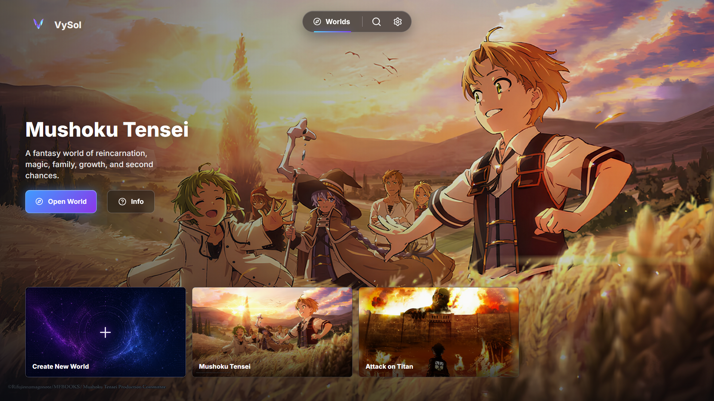

# VySol

Local-first graph RAG for roleplaying in pre-existing fictional worlds with grounded, inspectable lore context.

---

## Table of Contents

- [What It Solves](#what-it-solves)
- [What It Does](#what-it-does)
- [Why It Is Different](#why-it-is-different)
- [MAJOR MILESTONES ROADMAP](#major-milestones-roadmap)
- [Links](#links)
- [License](#license)

---

## What It Solves

VySol is for roleplayers who want believable scenes inside established fictional worlds without the context loss that makes standard RAG feel shallow, generic, or inconsistent. Standard chunk retrieval can find text that looks similar to the current message, but it often misses why a character acts a certain way, what world rules constrain a scene, or which past events should matter now.

Standard RAG retrieves what was mentioned. VySol retrieves what matters.

## What It Does

### Graph Extraction Pipeline

The current feature worth highlighting is the graph extraction pipeline. VySol takes persisted story chunks and runs resumable extraction passes that turn prose into raw node and edge candidates: characters, places, objects, factions, events, rules, and relationships that can later become graph context.

This matters because fictional worlds do not break only because a model forgot a sentence. They break because the model missed the relationship behind the sentence: why a character acts angry, which rule makes a spell impossible, what earlier mistake still shapes a scene, or which place/faction/object carries hidden context.

### Supporting Ingestion Work

The graph pipeline sits on top of local source ingestion, chunking, embedding, provider-key scheduling, saved manifests, Qdrant vectors, and local Neo4j manifestation work. Those systems exist to make graph extraction resumable and inspectable, but the graph extraction pipeline is the main current feature being presented here.

## Why It Is Different

### It Targets The Missing Cause, Not Just The Matching Scene

In tools like SillyTavern, long-running roleplay often depends on lorebooks, memory entries, summaries, or normal chunk retrieval. Those can help, but they still tend to retrieve what looks similar to the current message. If a character is arguing right now, the system may retrieve another argument scene while missing the childhood abuse, self-blame, betrayal, oath, or world rule that actually explains why the argument matters.

VySol is being built around that pain. The goal is not only to retrieve a matching chunk, but to recover the connected background that a human reader would know belongs in the scene even when the wording is not semantically similar.

### It Is Being Designed Around Story Time

Fictional worlds are temporal. A fact can be true in book five but unavailable in book one. A relationship can change after a betrayal. A character can learn a secret, lose a power, or misunderstand an event for hundreds of pages.

VySol's planned temporal index is meant to attach story position to chunks, edges, node descriptions, and graph facts. That would let retrieval respect where the scene is in the story instead of leaking future knowledge or flattening the whole corpus into one timeless memory pile.

### It Treats Entity Resolution As A Fictional-Corpus Problem

Large fictional corpora create giant repeated entities. A main character can appear in so many chunks that a single node description becomes enormous. Many systems handle this by summarizing heavily, but heavy summaries often erase the exact details that made the character or world rule useful in the first place.

VySol is planned to start with exact normalization and later move into AI entity resolution for those large fictional entities. The point is to merge and organize repeated lore without crushing it into a lossy summary too early.

## MAJOR MILESTONES ROADMAP

### Full UI With Real-Time Graph Animation

VySol will get a fuller world interface built around the graph itself. As a world is ingested, the graph will visually grow: new characters, places, rules, and relationships appearing as they are discovered. Existing worlds will open into a settled graph, while live ingestion will make the world feel like it is assembling in front of you.

### Retrieval Engine

The retrieval engine is the part that turns the ingested world into useful roleplay context. Instead of only grabbing similar text, it will combine relevant chunks, graph nodes, relationships, and chat history so the AI has a better chance of remembering why a scene matters.

### Temporal Indexer

VySol will track where information comes from in the story, such as which book and chunk produced it. This is meant to help the AI understand story order, avoid future spoilers when needed, and keep facts grounded to the point in the world where they were actually known.

### Entity Resolution

Large fictional worlds repeat the same characters, places, and concepts in many forms. VySol will merge matching entities so the graph does not become cluttered with duplicates, while still preserving important details instead of flattening everything into a tiny summary.

### Retrieval Benchmark Mode

Benchmark mode will let users compare different retrieval styles on the same world. You will be able to ask one question and see how chunk-only retrieval, graph-only retrieval, and hybrid retrieval behave side by side.

### Failed Chunk Repair And Retry

If one chunk fails during ingestion, VySol will let users review that specific chunk, retry it, or repair it without throwing away the whole world. This is meant to make large ingestions less fragile when a provider blocks, times out, or returns unusable output.

---

## Links

- [Documentation](https://vyce101.github.io/VySolReal/) - These docs track the latest `main` branch. Released app builds may not include every documented feature yet.
- [Quickstart](docs/QUICKSTART.md)
- [Changelog](docs/CHANGELOG.md) - See this for unreleased changes that are only available in the latest commits.
- [Commercial License](<docs/COMMERCIAL LICENSE.md>)
- [License](LICENSE)
- [GitHub Issues](https://github.com/Vyce101/VySolReal/issues)
- [GitHub Discussions](https://github.com/Vyce101/VySolReal/discussions)

## License

This project is dual-licensed.

- Open-source use: GNU AGPLv3 ([LICENSE](LICENSE))
- Commercial use: [Commercial License](<docs/COMMERCIAL LICENSE.md>)
