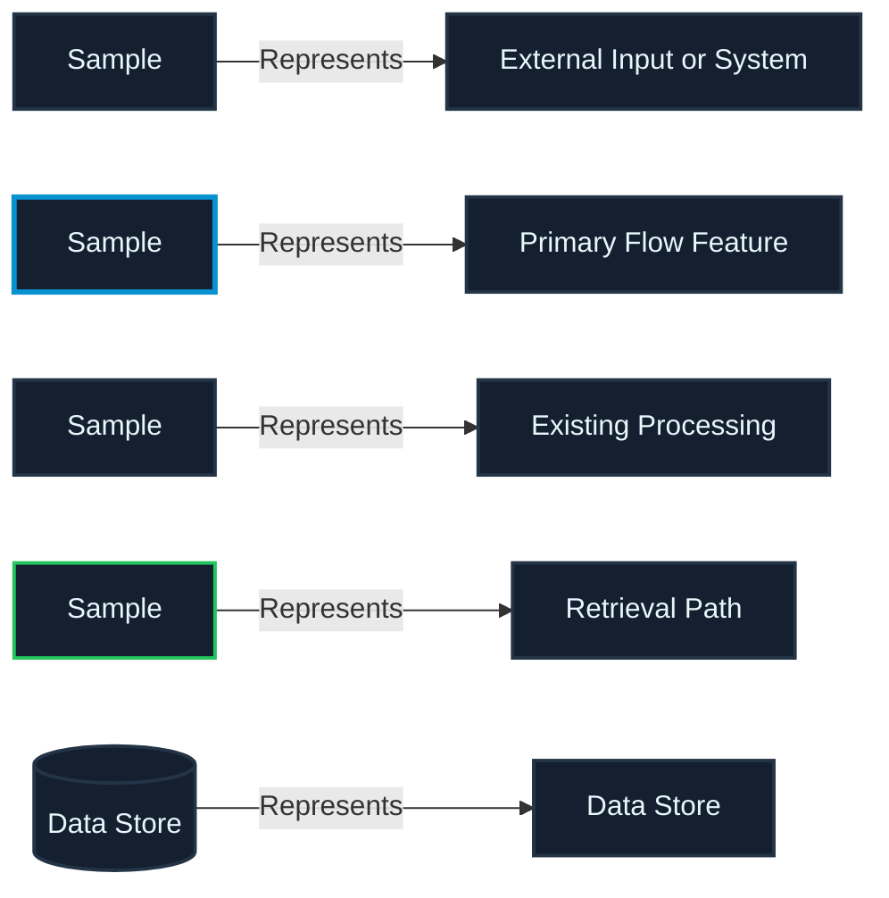
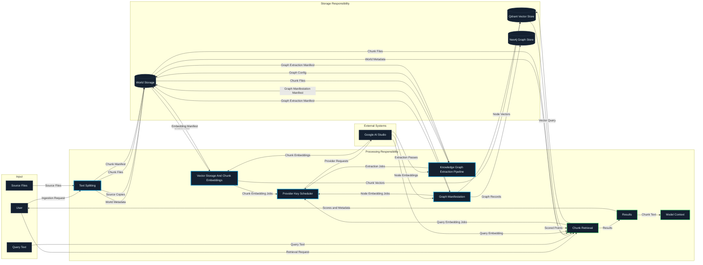

# System Flow Diagram

This view shows the feature-level path from source files to chunk storage, vector indexing, graph manifestation, retrieval results, and model context.

```mermaid
flowchart LR
    classDef external fill:#142030,color:#E8F7FC,stroke:#243447,stroke-width:2px;
    classDef process fill:#142030,color:#E8F7FC,stroke:#243447,stroke-width:2px;
    classDef primary fill:#142030,color:#E8F7FC,stroke:#0892D0,stroke-width:3px;
    classDef store fill:#142030,color:#E8F7FC,stroke:#243447,stroke-width:2px;
    classDef retrieval fill:#142030,color:#E8F7FC,stroke:#22C55E,stroke-width:2px;

    externalSample["Sample"] -->|Represents| externalLabel["External Input or System"]
    primarySample["Sample"] -->|Represents| primaryLabel["Primary Flow Feature"]
    processSample["Sample"] -->|Represents| processLabel["Existing Processing"]
    retrievalSample["Sample"] -->|Represents| retrievalLabel["Retrieval Path"]
    storeSample[("Data Store")] -->|Represents| storeLabel["Data Store"]

    class externalSample external;
    class primarySample primary;
    class processSample,externalLabel,primaryLabel,processLabel,retrievalLabel,storeLabel process;
    class retrievalSample retrieval;
    class storeSample store;
```

```mermaid
flowchart LR
    classDef external fill:#142030,color:#E8F7FC,stroke:#243447,stroke-width:2px;
    classDef process fill:#142030,color:#E8F7FC,stroke:#243447,stroke-width:2px;
    classDef primary fill:#142030,color:#E8F7FC,stroke:#0892D0,stroke-width:3px;
    classDef store fill:#142030,color:#E8F7FC,stroke:#243447,stroke-width:2px;
    classDef retrieval fill:#142030,color:#E8F7FC,stroke:#22C55E,stroke-width:2px;

    subgraph Input["Input"]
        direction TB
        user["User"]
        sourceFiles["Source Files"]
        queryText["Query Text"]
    end

    subgraph Processing["Processing Responsibility"]
        direction TB
        textSplitting["Text Splitting"]
        embeddings["Vector Storage And Chunk Embeddings"]
        scheduler["Provider Key Scheduler"]
        extraction["Knowledge Graph Extraction Pipeline"]
        manifestation["Graph Manifestation"]
        chunkRetrieval["Chunk Retrieval"]
        results["Results"]
        modelContext["Model Context"]
    end

    subgraph Storage["Storage Responsibility"]
        direction TB
        worldStorage[("World Storage")]
        qdrant[("Qdrant Vector Store")]
        neo4j[("Neo4j Graph Store")]
    end

    subgraph ExternalSystems["External Systems"]
        direction TB
        google["Google AI Studio"]
    end

    user -->|Ingestion Request| textSplitting
    sourceFiles -->|Source Files| textSplitting
    textSplitting -->|World Metadata| worldStorage
    textSplitting -->|Source Copies| worldStorage
    textSplitting -->|Chunk Files| worldStorage
    textSplitting -->|Chunk Manifest| worldStorage
    worldStorage -->|Chunk Files| embeddings
    embeddings -->|Chunk Embedding Jobs| scheduler
    scheduler -->|Provider Requests| google
    google -->|Chunk Embeddings| embeddings
    embeddings -->|Chunk Vectors| qdrant
    embeddings -->|Embedding Manifest| worldStorage
    worldStorage -->|Chunk Files| extraction
    worldStorage -->|Graph Config| extraction
    extraction -->|Extraction Jobs| scheduler
    google -->|Extraction Passes| extraction
    extraction -->|Graph Extraction Manifest| worldStorage
    worldStorage -->|Graph Extraction Manifest| manifestation
    manifestation -->|Node Embedding Jobs| scheduler
    google -->|Node Embeddings| manifestation
    manifestation -->|Node Vectors| qdrant
    manifestation -->|Graph Records| neo4j
    manifestation -->|Graph Manifestation Manifest| worldStorage
    user -->|Retrieval Request| chunkRetrieval
    queryText -->|Query Text| chunkRetrieval
    worldStorage -->|World Metadata| chunkRetrieval
    worldStorage -->|Chunk Files| chunkRetrieval
    chunkRetrieval -->|Query Embedding Jobs| scheduler
    google -->|Query Embedding| chunkRetrieval
    chunkRetrieval -->|Vector Query| qdrant
    qdrant -->|Scored Points| chunkRetrieval
    chunkRetrieval -->|Results| results
    results -->|Chunk Text| modelContext
    results -->|Scores and Metadata| user

    class user,sourceFiles,queryText,google external;
    class textSplitting,embeddings,extraction,manifestation,scheduler primary;
    class worldStorage,qdrant,neo4j store;
    class chunkRetrieval,results,modelContext retrieval;
```
