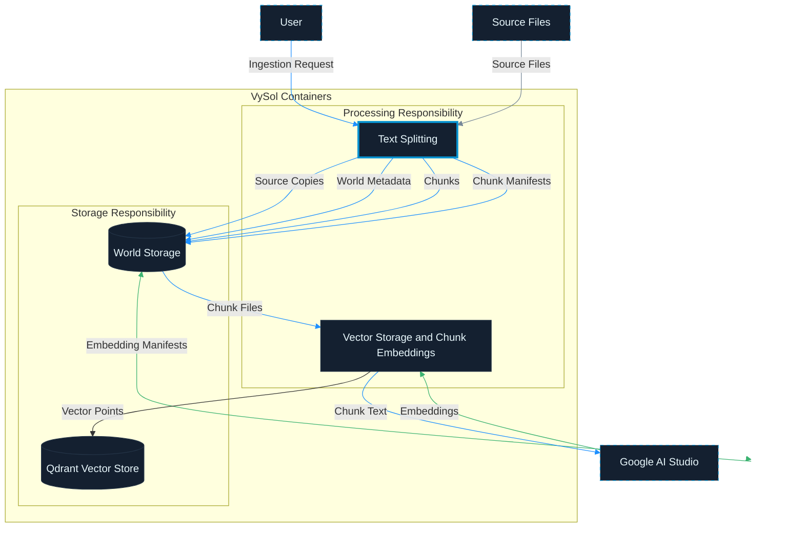

# Architecture

This container-level view shows how VySol moves source books into world-backed chunks and then into retrieval-ready vectors.

```mermaid
flowchart LR
    classDef external fill:#142030,color:#E8F7FC,stroke:#0892D0,stroke-dasharray: 5 5;
    classDef primary fill:#142030,color:#E8F7FC,stroke:#0892D0,stroke-width:3px;
    classDef store fill:#142030,color:#E8F7FC,stroke:#243447,stroke-width:1px;
    classDef ghost fill:none,stroke:none,color:transparent;

    PC["Primary Container"]:::primary --- DS[("Data Store")]:::store
    DS --- EA["External Actor or System"]:::external
    EA --- PF1[" "]:::ghost
    PF1 -->|Primary Flow| PF2[" "]:::ghost
    PF2 --- RI1[" "]:::ghost
    RI1 -->|Raw Input| RI2[" "]:::ghost
    RI2 --- CO1[" "]:::ghost
    CO1 -->|Confirmed Output| CO2[" "]:::ghost

    linkStyle 0 stroke-width:0px;
    linkStyle 1 stroke-width:0px;
    linkStyle 2 stroke-width:0px;
    linkStyle 3 stroke:dodgerblue;
    linkStyle 4 stroke-width:0px;
    linkStyle 5 stroke:lightslategray;
    linkStyle 6 stroke-width:0px;
    linkStyle 7 stroke:mediumseagreen;
```

```mermaid
flowchart TB
    classDef external fill:#142030,color:#E8F7FC,stroke:#0892D0,stroke-dasharray: 5 5;
    classDef ghost fill:none,stroke:none,color:transparent;
    classDef process fill:#142030,color:#E8F7FC,stroke:#243447,stroke-width:1px;
    classDef primary fill:#142030,color:#E8F7FC,stroke:#0892D0,stroke-width:3px;
    classDef store fill:#142030,color:#E8F7FC,stroke:#243447,stroke-width:1px;

    subgraph Scope["VySol Containers"]
        direction TB

        subgraph Processing["Processing Responsibility"]
            direction TB
            TS["Text Splitting"]:::primary
            VCE["Vector Storage and Chunk Embeddings"]:::process
        end

        subgraph Storage["Storage Responsibility"]
            direction TB
            WS[("World Storage")]:::store
            QVS[("Qdrant Vector Store")]:::store
        end
    end

    U["User"]:::external
    SF["Source Files"]:::external
    GAI["Google AI Studio"]:::external
    EM[" "]:::ghost

    U -->|Ingestion Request| TS
    SF -->|Source Files| TS
    TS -->|Source Copies| WS
    TS -->|World Metadata| WS
    TS -->|Chunks| WS
    TS -->|Chunk Manifests| WS
    WS -->|Chunk Files| VCE
    VCE --> EM
    EM -->|Embedding Manifests| WS
    VCE -->|Chunk Text| GAI
    GAI -->|Embeddings| VCE
    VCE -->|Vector Points| QVS

    linkStyle 0 stroke:dodgerblue;
    linkStyle 1 stroke:lightslategray;
    linkStyle 2 stroke:dodgerblue;
    linkStyle 3 stroke:dodgerblue;
    linkStyle 4 stroke:dodgerblue;
    linkStyle 5 stroke:dodgerblue;
    linkStyle 6 stroke:dodgerblue;
    linkStyle 7 stroke:mediumseagreen,stroke-width:0px;
    linkStyle 8 stroke:mediumseagreen;
    linkStyle 9 stroke:dodgerblue;
    linkStyle 10 stroke:mediumseagreen;
```
