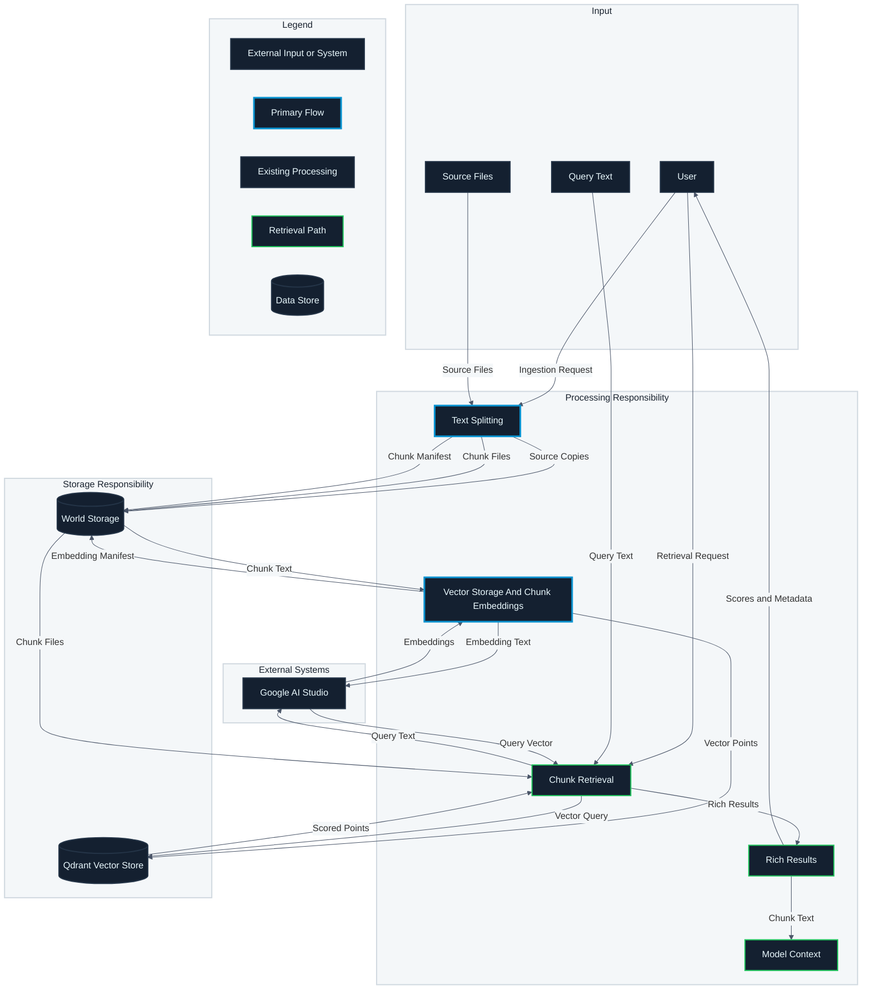

# System Flow Diagram

This view shows the feature-level path from source files to chunks, vectors, retrieval results, and model context.

```mermaid
%%{init: {"theme": "base", "themeVariables": {"background": "#F4F7F9", "clusterBkg": "#F4F7F9", "clusterBorder": "#D1D9E0", "lineColor": "#4A5568", "textColor": "#1B2430", "edgeLabelBackground": "#F4F7F9"}}}%%
flowchart TB
    classDef external fill:#142030,color:#E8F7FC,stroke:#243447,stroke-width:2px;
    classDef process fill:#142030,color:#E8F7FC,stroke:#243447,stroke-width:2px;
    classDef primary fill:#142030,color:#E8F7FC,stroke:#0892D0,stroke-width:3px;
    classDef store fill:#142030,color:#E8F7FC,stroke:#243447,stroke-width:2px;
    classDef retrieval fill:#142030,color:#E8F7FC,stroke:#22C55E,stroke-width:2px;

    subgraph Input["Input"]
        direction TB
        user[User]
        sourceFiles[Source Files]
        queryText[Query Text]
    end

    subgraph Processing["Processing Responsibility"]
        direction TB
        textSplitting[Text Splitting]
        embeddings[Vector Storage And Chunk Embeddings]
        chunkRetrieval[Chunk Retrieval]
        richResults[Rich Results]
        modelContext[Model Context]
    end

    subgraph Storage["Storage Responsibility"]
        direction TB
        worldStorage[(World Storage)]
        qdrant[(Qdrant Vector Store)]
    end

    subgraph ExternalSystems["External Systems"]
        direction TB
        google[Google AI Studio]
    end

    user -->|Ingestion Request| textSplitting
    sourceFiles -->|Source Files| textSplitting
    textSplitting -->|Source Copies| worldStorage
    textSplitting -->|Chunk Files| worldStorage
    textSplitting -->|Chunk Manifest| worldStorage
    worldStorage -->|Chunk Text| embeddings
    embeddings -->|Embedding Text| google
    google -->|Embeddings| embeddings
    embeddings -->|Vector Points| qdrant
    embeddings -->|Embedding Manifest| worldStorage
    user -->|Retrieval Request| chunkRetrieval
    queryText -->|Query Text| chunkRetrieval
    chunkRetrieval -->|Query Text| google
    google -->|Query Vector| chunkRetrieval
    chunkRetrieval -->|Vector Query| qdrant
    qdrant -->|Scored Points| chunkRetrieval
    worldStorage -->|Chunk Files| chunkRetrieval
    chunkRetrieval -->|Rich Results| richResults
    richResults -->|Chunk Text| modelContext
    richResults -->|Scores and Metadata| user

    subgraph Legend["Legend"]
        direction LR
        legendExternal[External Input or System]
        legendPrimary[Primary Flow]
        legendProcess[Existing Processing]
        legendRetrieval[Retrieval Path]
        legendStore[(Data Store)]
    end

    class user,sourceFiles,queryText,google,legendExternal external;
    class textSplitting,embeddings,legendPrimary primary;
    class legendProcess process;
    class worldStorage,qdrant,legendStore store;
    class chunkRetrieval,richResults,modelContext,legendRetrieval retrieval;

    style Input fill:#F4F7F9,stroke:#D1D9E0,stroke-width:2px,color:#1B2430
    style Processing fill:#F4F7F9,stroke:#D1D9E0,stroke-width:2px,color:#1B2430
    style Storage fill:#F4F7F9,stroke:#D1D9E0,stroke-width:2px,color:#1B2430
    style ExternalSystems fill:#F4F7F9,stroke:#D1D9E0,stroke-width:2px,color:#1B2430
    style Legend fill:#F4F7F9,stroke:#D1D9E0,stroke-width:2px,color:#1B2430
```
