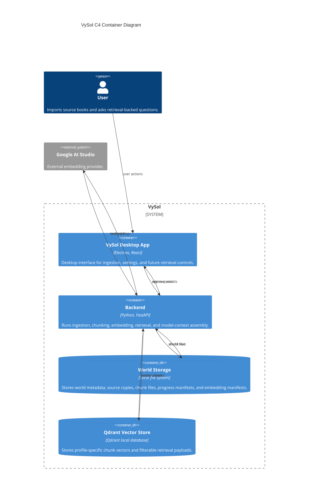

# C4 Container Diagram

This view shows VySol as runtime containers and data stores. Feature logic such as text splitting, embeddings, and chunk retrieval runs inside the backend container.

## Legend

- Person: someone using VySol.
- Container: a running application inside VySol.
- Database container: a data store owned by VySol.
- External system: a provider outside VySol.
- Relationship labels name the data or request crossing a boundary.
