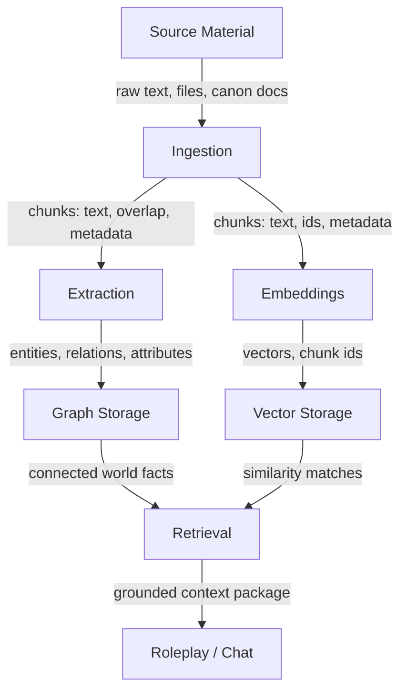

# Architecture

Placeholder architecture diagram for the app.

```mermaid
flowchart TD
    A["Source Material"] -->|"raw text, files, canon docs"| B["Ingestion"]
    B -->|"chunks: text, overlap, metadata"| C["Extraction"]
    C -->|"entities, relations, attributes"| D["Graph Storage"]
    B -->|"chunks: text, ids, metadata"| E["Embeddings"]
    E -->|"vectors, chunk ids"| F["Vector Storage"]
    D -->|"connected world facts"| G["Retrieval"]
    F -->|"similarity matches"| G
    G -->|"grounded context package"| H["Roleplay / Chat"]
```
